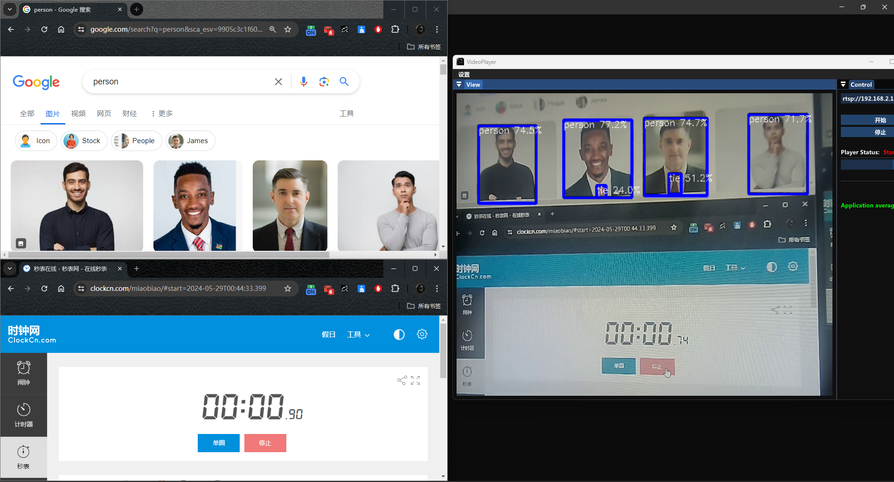
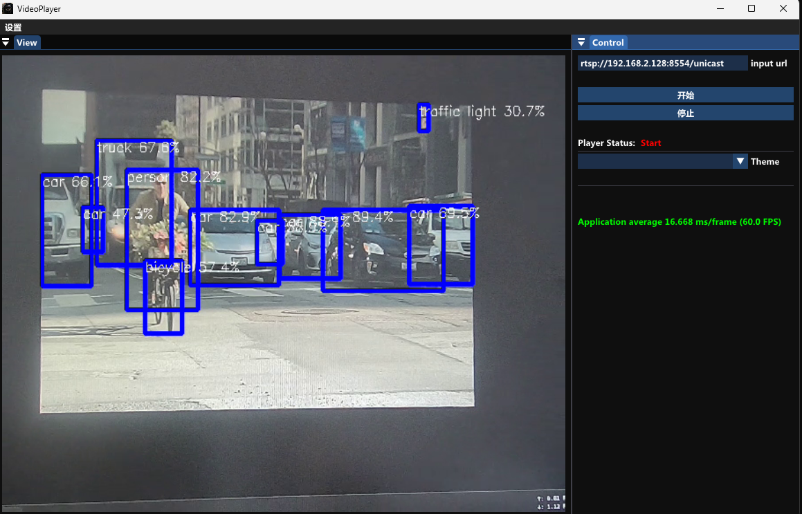

# RkYoloRtspServer

RK3588 上的 YOLOv5 RTSP 推流服务，支持 USB 摄像头采集、RKNN 推理、Rockchip MPP 硬件 H.264 编码，以及 Live555 RTSP 服务输出。

当前版本已经补充了：

- 双摄像头双路 RTSP 推流
- 配置文件自动同步到构建目录
- 启动时等待首个 IDR 再发流，减少首屏绿屏
- 双路模式下按推理完成顺序编码，避免编码读取未完成缓冲导致花屏/绿屏
- 摄像头初始化失败时不再直接段错误

## Test Env

- RK3588 / RK3588S
- Ubuntu 20.04
- USB UVC camera

## Features

- support YUYV USB camera
- support hardware H.264 encode
- YOLOv5 target detection
- multiple NPU cores
- dual-camera RTSP streaming

## Build

首次构建：

```bash
cd /home/orangepi/Desktop/web/RkYoloRtspServer-master
./scripts/build_mpp.sh
mkdir -p build_localtest
cd build_localtest
cmake ..
cmake --build . -j4 --target RkYoloRtspServer
```

后续增量编译：

```bash
cd /home/orangepi/Desktop/web/RkYoloRtspServer-master/build_localtest
cmake --build . -j4 --target RkYoloRtspServer
```

说明：

- 每次 `cmake --build` 都会自动把源码目录下的 `configs/` 和 `model/` 同步到 `build_localtest/`
- 运行程序时请在 `build_localtest` 目录下启动，因为程序按相对路径读取 `./configs/config.ini` 和 `./model/...`

## Run

```bash
cd /home/orangepi/Desktop/web/RkYoloRtspServer-master/build_localtest
sudo ./RkYoloRtspServer
```

如果启动成功，日志里会打印 RTSP 地址，例如：

```text
rtsp://192.168.137.224:8556/cam0
rtsp://192.168.137.224:8556/cam1
```

本机测试：

```bash
ffplay -rtsp_transport tcp rtsp://127.0.0.1:8556/cam0
ffplay -rtsp_transport tcp rtsp://127.0.0.1:8556/cam1
```

或者：

```bash
ffprobe -v error -rtsp_transport tcp -show_streams -select_streams v:0 rtsp://127.0.0.1:8556/cam0
ffprobe -v error -rtsp_transport tcp -show_streams -select_streams v:0 rtsp://127.0.0.1:8556/cam1
```

## Config

配置文件位置：

```text
configs/config.ini
```

当前推荐的双路配置示例：

```ini
[rknn]
model_path = model/yolov5m.rknn
rknn_thread = 3

[log]
level = NOTICE

[video]
width = 640
height = 480
fps = 30
fix_qp = 23
device = /dev/video0

[video0]
device = /dev/video0
stream_name = cam0

[video1]
device = /dev/video2
stream_name = cam1

[server]
rtsp_port = 8556
stream_name = unicast
max_buf_size = 200000
max_packet_size = 1500
http_enable = false
http_port = 8000
bitrate = 1440
```

说明：

- `[video]` 是默认值
- `[video0]`、`[video1]` 是每路覆盖配置
- `stream_name` 决定 RTSP 路径，例如 `cam0` 对应 `/cam0`
- 如果没有 `[video0]`、`[video1]`，程序会回退到旧的单路 `[video]` 配置

## Single Camera Mode

如果只想跑单路，可以删掉或注释 `[video0]`、`[video1]`，只保留：

```ini
[video]
width = 640
height = 480
fps = 30
fix_qp = 23
device = /dev/video0

[server]
rtsp_port = 8556
stream_name = unicast
```

此时输出地址类似：

```text
rtsp://<ip>:8556/unicast
```

## Dual Camera Mode

双路模式下，程序会：

- 为 `video0`、`video1` 各创建一个 `TransCoder`
- 每路各自采集、推理、编码
- 在同一个 RTSP server 端口下挂不同流名

例如：

- `rtsp://<ip>:8556/cam0`
- `rtsp://<ip>:8556/cam1`

## Green Screen Fix Summary

之前双路模式下容易出现“启动时绿屏”或“整屏花掉”，主要做了这些修复：

1. `CamFramedSource` 从 LIFO 改成 FIFO  
   以前发送缓存使用 `back()/pop_back()`，会打乱帧顺序。  
   现在改成 `front()` + `erase(begin())`，保证按产生顺序送出。

2. 新客户端先等待 IDR 再开始送流  
   客户端刚连上时，如果先收到 P 帧，解码器可能先绿一下。  
   现在会先丢弃非 IDR，直到拿到关键帧再开始发。

3. 双路推理结果按 future 完成顺序编码  
   以前把推理任务丢进线程池后，没有等待它完成，就直接取输出缓冲编码。  
   双路并发时很容易读到尚未完成的推理输出，从而导致整屏绿/花。  
   现在每个任务都带 `future`，确认推理完成后才编码对应输出槽。

4. 修复 `libv4l2cc` 错误日志格式串导致的段错误  
   原来摄像头初始化失败时，错误日志本身可能先把程序打崩。  
   现在会正常打印真实错误。

## Troubleshooting

### 1. Device or resource busy

如果看到：

```text
Cannot set format to YUYV: Device or resource busy
```

说明摄像头被别的程序占住了。先查并结束旧进程：

```bash
ps -ef | grep 'RkYoloRtspServer' | grep -v grep
ps -ef | grep 'rknn_http_ctrl_zero_copy' | grep -v grep
sudo kill -TERM <pid>
```

### 2. Config modified but program still uses old values

如果你改了 `configs/config.ini` 但运行结果没变，重新执行：

```bash
cd /home/orangepi/Desktop/web/RkYoloRtspServer-master/build_localtest
cmake --build . -j4 --target RkYoloRtspServer
```

因为现在构建过程会自动同步 `configs/` 到 `build_localtest/`。

### 3. No such file or directory when running

请在 `build_localtest` 目录下运行：

```bash
cd /home/orangepi/Desktop/web/RkYoloRtspServer-master/build_localtest
sudo ./RkYoloRtspServer
```

### 4. Want to verify the stream quickly

```bash
ffprobe -v error -rtsp_transport tcp -show_streams -select_streams v:0 rtsp://127.0.0.1:8556/cam0
ffprobe -v error -rtsp_transport tcp -show_streams -select_streams v:0 rtsp://127.0.0.1:8556/cam1
```

## Resource Utilization

- yolov5s

```text
1 -- NPU load:  Core0: 38%, Core1:  0%, Core2:  0%,
2 -- NPU load:  Core0: 25%, Core1: 26%, Core2:  0%,
3 -- NPU load:  Core0: 16%, Core1: 17%, Core2: 17%,
4 -- NPU load:  Core0: 23%, Core1: 13%, Core2: 13%,
5 -- NPU load:  Core0: 20%, Core1: 20%, Core2: 10%,
6 -- NPU load:  Core0: 16%, Core1: 17%, Core2: 17%,
```

- yolov5m

```text
1 -- NPU load:  Core0: 75%, Core1:  0%, Core2:  0%,
2 -- NPU load:  Core0: 69%, Core1: 74%, Core2:  0%,
3 -- NPU load:  Core0: 49%, Core1: 49%, Core2: 49%,
4 -- NPU load:  Core0: 71%, Core1: 38%, Core2: 39%,
5 -- NPU load:  Core0: 59%, Core1: 60%, Core2: 30%,
6 -- NPU load:  Core0: 49%, Core1: 50%, Core2: 49%,
```

## Demo

- yolov5s  


- yolov5m  


## Tags Notes

```text
v1.0.0 -- single npu && corresponds to rktoolkit 1.5.0 or below
v1.1.0 -- multiple npu && corresponds to rktoolkit 1.5.0 or below
v2.0.0 -- multiple npu && corresponds to rktoolkit 1.5.2 or up
```
